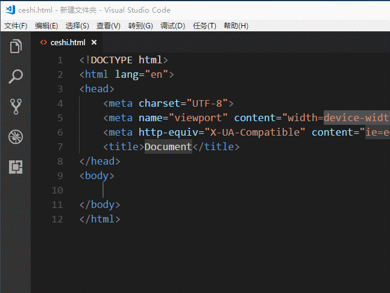

#[我的笔记]vscode插件
***

```
说明:之前一直是用的是sublime编辑器,最近准备开始使用vscode编辑器,所以这里简单记录下我使用vscode这个编辑器过程中用到的个人觉得相对比较好用些的插件,以后有遇到更好的,我也会尽量及时补充.寒暄几句哈
ps:因为是自用笔记,所以难免有时候
```

##Sublime Text Keymap
>因为之前一直是用的都是sublime,所以软件刚安装好之后,也就选择了sublime的键盘方案,所以这个插件就自动安装了

##View in Browser
>从dw到sublime一路走来,一直把dw中的F12作为直接在浏览器中预览HTML的快捷键,但是vscode 中是没有的(或者我没找到),所以就安装了这个插件,但是这个插件的快捷键模式是ctrl+F1,后面试了下,觉得也挺顺手:)



